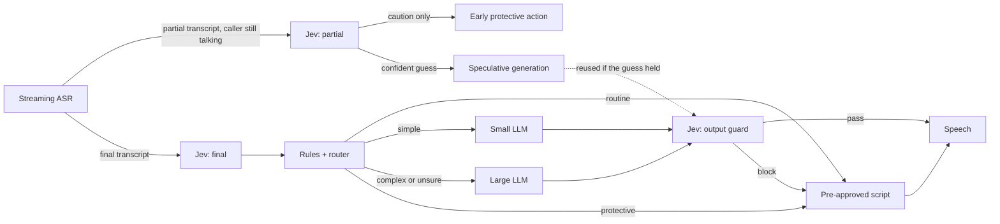

# jevelin

**Fast, low-cost real-time agents.**

**[Try it in your browser →](https://henryzhangpku.github.io/jevelin/)**

A real-time agent makes a dozen small decisions on every turn. *Is this person
reading out a card number? Do they want a human? Is this routine or hard? Is my
draft reply safe to say?* Most stacks send each one to an LLM, which puts them in
the latency budget and the token bill of every turn.

`jevelin` is a working reference design for the other approach: take those decisions
**off the critical path**. It answers them with a **System One classifier** such as
[Jev](https://www.langchain.com/blog/building-a-harness-with-jev) from TypeSafe AI,
which returns typed, calibrated probabilities (no text) in a few hundred milliseconds.
The classifier runs alongside the conversation instead of in front of it, and every turn
is scheduled as a dependency graph, so time to first audio is simply its critical path.

```
pack: support | 300 calls, 1496 caller turns | classifier: mock | seed 7

                                            baseline     fast path
                                            --------     ---------
Time to first audio, p50                    1,656 ms        626 ms
Time to first audio, p95                    2,389 ms      1,169 ms
Turns over 800 ms budget                        100%           32%
LLM tokens per call                            9,198         2,875
Classifier tokens per call                         0         3,396
Model cost per call                          $0.0407       $0.0034
  of which wasted speculation                      -         15.7%
Turns answered by a script                       13%           66%
Protective actions                               197           195
  decided at, p50 (0 = caller stops)        1,086 ms        350 ms
  decided before caller finished                   0            70
Risky drafts spoken to caller                     66             0
Risky drafts blocked                               0            45
Fail-closed turns                                  0            25
```

These numbers are **simulated from an illustrative latency and price profile**, not
measured on production traffic. The profile is a JSON file. Replace it with your own
p50/p95 measurements and the same code gives your numbers. See
[What's real and what's simulated](#whats-real-and-whats-simulated).

## Quickstart

No dependencies beyond Python 3.10+, and no API keys:

```bash
python -m jevelin compare                 # 300 calls through both pipelines
python -m jevelin trace --call 0          # per-turn timelines, baseline vs fast
python -m jevelin live --call 0           # same pipeline, real concurrency, real time
python -m unittest -v                        # the claims below, as tests
```

The [browser demo](https://henryzhangpku.github.io/jevelin/) runs this same Python engine
in the page through Pyodide, so you can move the latency and speculation settings and
watch the timeline and cost change.

With Jev access, the same pipeline runs every classifier stage against the real API:

```bash
pip install typesafe-sdk
export TYPESAFE_API_KEY=...                  # https://console.typesafe.ai/keys
python -m jevelin compare --classifier jev --calls 20
```

## The two pipelines

**Baseline**, the common shape today: wait for the caller to finish, ask an LLM to judge
the turn, then generate the reply with a large model.

**Fast path:**



1. **Classify while the caller is still talking.** Jev reads the partial transcript
   before the turn ends, and it answers all its questions in one call.
2. **Script the routine turns.** Balance, due date, outage, password reset: these get
   pre-approved scripts with no LLM call at all. In the support pack that's two thirds
   of turns.
3. **Send the rest to the smallest model that fits.** When routing confidence is low,
   the turn goes to the large model.
4. **Generate speculatively.** Generation starts from the partial transcript's guess,
   and the draft is discarded if the final transcript disagrees.
5. **Guard every generated draft.** It can't be spoken until the output check passes.

Here's one complex turn from `trace`. `#` is a stage and `.` is the caller speaking.
Everything left of `|` happened before the caller finished:

```
FAST  turn 5  [complex]  "I was charged twice this month and I don't understand why, can you explain
    the bill?"
                          -3000     -2500     -2000     -1500     -1000     -500      0         +500      +1000  ms
caller speaking           ............................................................|
jev · partial                      ########                                           |
large_llm · speculative                                                               | ######
jev · final                                                                           | #########
policy                                                                                |          #
jev · guard                                                                           |          ######
tts                                                                                   |                ###
                          -> reply: complex turn | first audio at 1,010 ms
```

## The design rule

> **Raise the drawbridge. Never lower it.**

A classifier can make a turn more cautious. It can never make it less cautious.

Every classifier output leads to a stricter, pre-approved path: a protective script, a
transfer, a blocked draft, a hold. None of them unlocks anything. A missed flag leaves
the turn where the deterministic rules already put it, and a false alarm costs one
scripted sentence. That's what makes it safe to put a probabilistic model inside a loop
that talks to customers. It follows that:

- **Deterministic rules beat the classifier.** After hours, "transfer me" becomes a
  callback, whatever the model says. A `"*"` rule applies to every decision and needs
  no model at all, so it still holds when the classifier is down. See `rules` in the pack.
- **Partial transcripts can add caution but never route.** A card number is caught
  before the caller finishes reading it. A routing guess from a partial only starts
  speculative work, and it's thrown away if the full sentence says otherwise.
- **Fail closed.** If the classifier times out or errors, the turn gets the `hold`
  script, and a missing answer never counts as a pass. The executor turns exceptions
  into timeouts, so a provider outage can't crash a call.
- **Every decision is logged and reproducible.** `--ledger out.jsonl` records the state
  hash, the questions, the full answer distributions and the timings for every
  classifier call.

## Tradeoffs you can tune

**Speculation: latency versus wasted tokens.** Starting generation on a guess from the
partial transcript saves time when the guess is right and wastes tokens when it's wrong:

| `--speculate-min` | p95 first audio | Wasted spend | Cost per call |
|---|---|---|---|
| `0` (always speculate) | 1,169 ms | 15.7% | $0.0034 |
| `0.8` | 1,386 ms | 0.8% | $0.0029 |
| `1.01` (never) | 1,504 ms | 0% | $0.0029 |

**Routing confidence.** `route.confidence_floor` in the pack sets how sure the router has
to be before a turn goes to a script or a small model instead of the large one.

**Protective thresholds.** Each question has its own threshold. Safety flags use low,
recall-first thresholds, because a false alarm costs one sentence and a miss can cost
much more.

## One engine, many domains

Nothing about the domain lives in code. A **pack** (`packs/*.json`) defines:

| Section | What it is |
|---|---|
| `inbound` | Typed questions asked every turn: `noul`, `choice`, `score` |
| `guard` | Questions asked of every generated draft |
| `protective` | Which flags force which script, by severity, and which may act on partial transcripts |
| `rules` | Deterministic overrides, for example no transfers after hours |
| `route` | The routing question, confidence floor, speculation threshold, and model tiers |
| `scripts` | Pre-approved text, including the `hold` and `safe_fallback` scripts every pack needs |
| `turns`, `mix` | Synthetic traffic for simulation |

To model a new business, write a pack. The pipeline, the scheduler and the tests stay
the same:

```bash
python -m jevelin compare --pack path/to/your_pack.json --profile path/to/measured.json
```

## What's real and what's simulated

| | Status |
|---|---|
| Pipeline logic, routing, rules, guard, fail-closed behavior | Real code, covered by tests |
| Critical-path timing | Real. The simulator agrees with a live concurrent run (tested) |
| Jev classifier | Real with `--classifier jev`, otherwise simulated with the same interface |
| Classifier answers in simulation | Pattern-matched stand-ins. They show the pipeline, not model accuracy |
| LLM judge, reply generation, TTS | Simulated with latencies and prices from the profile |
| Latency and price numbers | Illustrative defaults until you replace them with measurements |

The baseline LLM judge is assumed to be **exactly as accurate** as the classifier, so the
comparison isolates latency and cost. Accuracy has to be measured separately on your own
labeled data, along with the classifier's determinism and p95 latency on your traffic.

## Layout

```
jevelin/
  executor.py   stage graph: simulated critical path or live concurrency, same pipeline
  pipelines.py  baseline and fast path, one caller turn each
  policy.py     rules, routing and fail-closed decisions; the caution-only invariant
  backends.py   Jev (real), simulated classifier, LLM judge, LLM, TTS
  report.py     comparison table and per-turn timelines
docs/           the browser demo (runs the engine above through Pyodide)
packs/          domains as data
profiles/       latency and price assumptions as data
tests/          the claims above, as tests
```

## License

MIT
